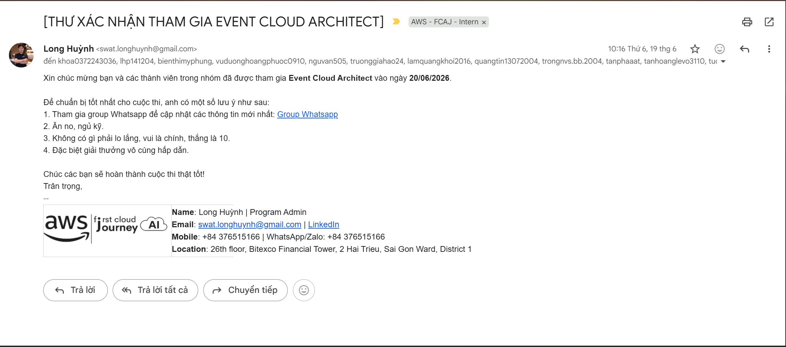

---

title: "Event 1"
date: 2024-01-01
weight: 1
chapter: false
pre: " <b> 4.1. </b> "
----------------------

# Bài thu hoạch “Event Cloud Architect”

### Mục Đích Của Sự Kiện

Event Cloud Architect được tổ chức nhằm tạo cơ hội cho các thành viên vận dụng kiến thức về AWS Cloud thông qua hình thức thi đấu theo đội. Hoạt động giúp người tham gia củng cố kiến thức về các dịch vụ AWS, rèn luyện khả năng phân tích câu hỏi và đưa ra quyết định trong thời gian giới hạn.

* Thành lập team và tham gia trả lời các câu hỏi từ các bộ đề do ban tổ chức biên soạn.
* Các câu hỏi tập trung vào kiến thức liên quan đến AWS Cloud và các dịch vụ phổ biến trên AWS.
* Có tổng cộng **8 đội** tham gia và được tổ chức theo hình thức thi đấu qua **3 vòng**, gồm:

  * **Vòng Tứ kết:** Các đội trả lời bộ câu hỏi để chọn ra những đội có kết quả tốt nhất bước vào vòng tiếp theo.
  * **Vòng Bán kết:** Các đội tiếp tục xử lý những câu hỏi có độ khó cao hơn nhằm chọn ra các đội tiến vào vòng chung kết.
  * **Vòng Chung kết:** Các đội đạt kết quả tốt ở vòng bán kết tiếp tục tranh tài tại sự kiện **Event 2 – Chung kết Event Cloud Architect**.

Thông qua hình thức thi đấu theo đội, em có cơ hội trao đổi kiến thức với các thành viên, phân chia việc xử lý câu hỏi và thống nhất đáp án trong thời gian giới hạn.

### Nội Dung Nổi Bật

#### Bộ đề AWS với độ khó tăng dần

Các bộ đề của sự kiện được xây dựng dựa trên kiến thức liên quan đến các chứng chỉ AWS, với độ khó tăng dần qua từng vòng. Nội dung yêu cầu người tham gia không chỉ ghi nhớ kiến thức mà còn phải hiểu cách các dịch vụ AWS hoạt động và lựa chọn phương án phù hợp với từng tình huống.

Một số nhóm kiến thức nổi bật được củng cố trong quá trình tham gia gồm:

* **AWS Core Services:** Củng cố kiến thức về các dịch vụ nền tảng như IAM, VPC, EC2, S3, RDS và các thành phần cơ bản của AWS.
* **Security và Access Control:** Hiểu rõ hơn về IAM, policy, role, quyền truy cập và nguyên tắc cấp quyền tối thiểu (**Least Privilege**).
* **Networking và Architecture:** Củng cố kiến thức về VPC, subnet, route table, Internet Gateway, NAT Gateway, Security Group và cách tổ chức tài nguyên trong một kiến trúc Cloud.
* **High Availability và Scalability:** Hiểu rõ hơn về Availability Zone, Multi-AZ, khả năng mở rộng và các phương án giúp hệ thống tăng tính sẵn sàng.
* **Monitoring và Operations:** Làm quen với các khái niệm liên quan đến monitoring, logging và vận hành hệ thống trên AWS.
* **AWS Architecture:** Rèn luyện khả năng phân tích yêu cầu và lựa chọn dịch vụ AWS phù hợp thay vì chỉ dựa vào việc ghi nhớ chức năng của từng dịch vụ.

#### Kỹ năng làm việc nhóm

Bên cạnh kiến thức kỹ thuật, hình thức thi đấu theo đội giúp em rèn luyện kỹ năng phối hợp và trao đổi thông tin. Khi gặp những câu hỏi có nhiều phương án gần giống nhau, các thành viên cần nhanh chóng phân tích, đưa ra lập luận và thống nhất đáp án.

#### Khả năng phân tích và ra quyết định

Các câu hỏi có thời gian trả lời giới hạn yêu cầu em phải đọc kỹ yêu cầu, xác định từ khóa quan trọng và loại bỏ những phương án không phù hợp trước khi lựa chọn đáp án.

Điều này giúp em cải thiện khả năng phân tích vấn đề và đưa ra quyết định nhanh chóng, đặc biệt đối với những câu hỏi yêu cầu áp dụng kiến thức AWS vào các tình huống thực tế.

### Những Gì Học Được

Thông qua Event Cloud Architect, em có cơ hội hệ thống hóa lại các kiến thức AWS đã học và nhận ra mối liên hệ giữa các dịch vụ trong một hệ thống Cloud.

Một số bài học chính gồm:

* Không nên chỉ học thuộc chức năng của từng dịch vụ mà cần hiểu **khi nào và tại sao nên sử dụng dịch vụ đó**.
* Một bài toán Cloud thường cần kết hợp nhiều dịch vụ để đáp ứng đồng thời các yêu cầu về bảo mật, hiệu năng, khả năng mở rộng và tính sẵn sàng.
* Khi phân tích một câu hỏi kiến trúc, cần xác định rõ yêu cầu trước khi lựa chọn giải pháp.
* Kiến thức về networking và security là nền tảng quan trọng khi thiết kế hệ thống trên AWS.
* Làm việc nhóm hiệu quả giúp tăng khả năng giải quyết các vấn đề có tính phức tạp.

### Ứng Dụng Vào Công Việc

Những kiến thức được củng cố thông qua sự kiện có thể áp dụng trực tiếp vào quá trình thực tập và triển khai dự án NeonFoodmap.

Cụ thể, em có thể vận dụng kiến thức về:

* **IAM** để phân quyền và kiểm soát quyền truy cập tài nguyên.
* **VPC, Subnet và Security Group** để xây dựng và kiểm soát kiến trúc mạng.
* **ECS Fargate** để triển khai ứng dụng container.
* **Application Load Balancer** để phân phối traffic đến các backend service.
* **RDS** để triển khai cơ sở dữ liệu và tăng tính sẵn sàng.
* **CloudWatch** để theo dõi metric, thu thập log và hỗ trợ xử lý sự cố.
* **ECR và CI/CD** để tự động hóa quá trình build và triển khai ứng dụng.

Đặc biệt, việc luyện tập các câu hỏi kiến trúc giúp em có cách tiếp cận tốt hơn khi phân tích yêu cầu triển khai thay vì lựa chọn dịch vụ một cách riêng lẻ.

### Trải Nghiệm Khi Tham Gia Sự Kiện

Event Cloud Architect mang lại cho em trải nghiệm thực tế về việc vận dụng kiến thức Cloud trong môi trường có tính cạnh tranh và giới hạn về thời gian.

Em có cơ hội:

* Trao đổi và học hỏi kiến thức AWS từ các thành viên trong team.
* Rèn luyện khả năng đọc hiểu và phân tích câu hỏi kỹ thuật.
* Làm quen với các dạng câu hỏi liên quan đến chứng chỉ AWS.
* Cải thiện kỹ năng làm việc nhóm và thống nhất quyết định.
* Nhận biết được những phần kiến thức AWS cần tiếp tục nghiên cứu và củng cố.

> Tổng thể, sự kiện không chỉ giúp em củng cố kiến thức kỹ thuật về AWS mà còn giúp em thay đổi cách tiếp cận đối với các bài toán Cloud. Thay vì chỉ tập trung vào từng dịch vụ riêng lẻ, em bắt đầu chú trọng hơn đến yêu cầu của hệ thống, mối quan hệ giữa các thành phần, khả năng bảo mật, tính sẵn sàng và khả năng mở rộng.

### Một số hình ảnh khi tham gia sự kiện

* 
[Video về sự kiện trên Facebook](https://www.facebook.com/share/r/1GUXvU6A4n/?utm_source=chatgpt.com)
