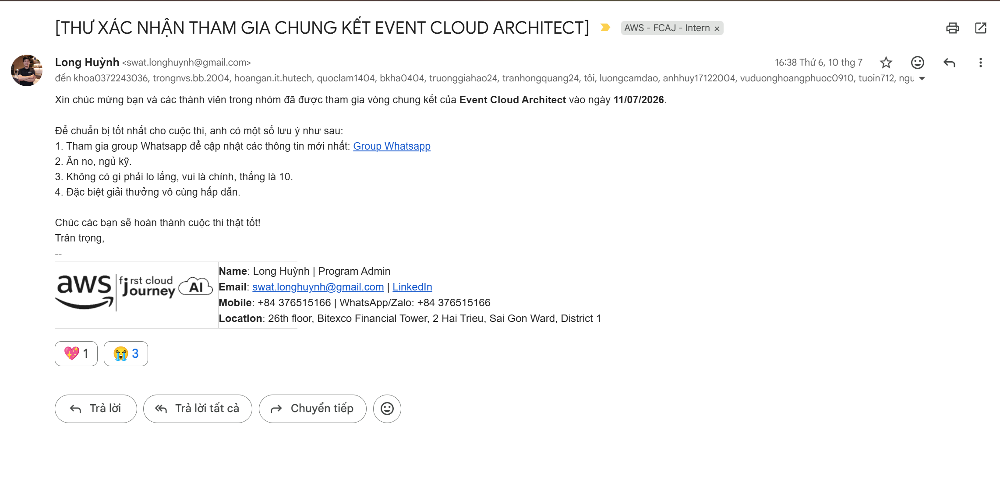

---

title: "Event 2"
date: 2024-01-01
weight: 2
chapter: false
pre: " <b> 4.2. </b> "
----------------------

# Reflection Report: “Cloud Architect Event Final”

## Event Purpose

Cloud Architect Event is a concluding event focused on sharing knowledge about cloud computing, modern application architecture, and security solutions on AWS. The event provided participants with opportunities to gain practical knowledge from experts while solving problems related to Cloud Architecture.

### Session 1: Cloud Architect Event Final

Participated in the Cloud Architect Event final round with my team, answering questions from a set randomly selected from the final two question sets prepared by the organizing committee.

### Session 2: Modern Application Design and AWS Security Agent

Mr. **Thinh Nguyen** shared best practices for designing and developing modern applications and introduced **AWS Security Agent**, a solution that supports specification-based source code security analysis.

Several issues discussed during the session included:

* Long product release cycles can cause businesses to miss business opportunities and incur additional costs.
* Inefficient development or operational processes can reduce team productivity and increase costs.
* Failure to meet security and compliance requirements can affect system security and the organization's reputation.
* Security should be considered throughout the software development process rather than being checked only at the final stage.
* AI-powered tools can help development teams identify and address certain issues more quickly during the development process.

Through this session, I gained a better understanding of the trend toward combining Cloud, DevOps, Security, and AI in modern software development processes.

### Session 3: Introduction to a Three-Tier Application Architecture on AWS

Mr. **Nguyễn Huỳnh Sơn** introduced a three-tier application architecture deployed on AWS. The architecture was designed to separate system components, deploy them across multiple Availability Zones, and apply access control and centralized monitoring mechanisms.

The main topics included:

* Separating the system into different tiers to improve manageability and security.
* Using VPCs and subnets to organize resources into different network layers.
* Deploying the system across multiple Availability Zones to improve availability.
* Using access control mechanisms to restrict access between components.
* Using monitoring and logging services to track system activities.
* Designing an architecture that can scale and meet practical operational requirements.

This session helped me reinforce my understanding of three-tier architecture and gain a clearer understanding of how multiple AWS services can be combined to build a highly available, secure, and well-monitored system.

## List of Speakers

* **Thinh Nguyen** – Cloud Engineer | DevOps Engineer | Full-Stack Developer | AWS First Cloud AI Journey
  [LinkedIn – Thinh Nguyen](https://www.linkedin.com/in/thinhnguyen1211/?utm_source=chatgpt.com)

* **Nguyễn Huỳnh Sơn** – Cloud RAN 5G Support Engineer @Endava | AWS Cloud Club Core Team
  [LinkedIn – Nguyễn Huỳnh Sơn](https://www.linkedin.com/in/huynhson081103/?utm_source=chatgpt.com)

## Key Highlights

### Introduction to AWS Security Agent – Source Code Security Analysis

One of the key highlights of the event was the introduction to AWS Security Agent and the application of modern tools to support source code security assessment and analysis.

During software development, several issues can directly affect business operations:

| Issue                                 | Impact                                                                           |
| ------------------------------------- | -------------------------------------------------------------------------------- |
| Long product release cycles           | Delays product delivery to users and may result in missed business opportunities |
| Inefficient operational processes     | Reduces productivity and increases operational costs                             |
| Failure to meet security requirements | Increases the risk of incidents and can damage the organization's reputation     |
| Late detection of security issues     | Increases the time and cost required for remediation                             |

From the content presented, I realized that security should be integrated throughout the entire software development lifecycle. Using automated tools can help identify issues earlier, reduce manual testing time, and support development teams in improving source code quality.

### Monitoring

Monitoring is an important component of operating Cloud-based systems. Successfully deploying an application is not enough; developers also need to monitor the system's operational status after deployment.

The session helped me gain a better understanding of the following aspects:

* Monitoring the operational status of resources and applications.
* Collecting and centralizing logs for analysis.
* Setting up alerts when abnormal conditions occur.
* Using monitoring data to help identify root causes when incidents occur.
* Combining monitoring and logging to improve system observability.

These concepts are highly practical for systems deployed on AWS, especially when the system uses multiple services such as ECS, Load Balancers, RDS, and networking components.

## What I Learned

### Design Thinking

I gained a better understanding that Cloud architecture design should start with system requirements rather than selecting services first. When designing an architecture, multiple factors need to be considered simultaneously:

* Availability.
* Scalability.
* Security.
* Performance.
* Observability.
* Operating costs.
* Maintainability and future scalability.

AWS services should be selected based on actual requirements and the relationships between system components rather than simply using more services to make the architecture more complex.

### Technical Architecture

Through the presentation on three-tier application architecture, I reinforced my understanding of how to organize a Cloud system into different layers.

In particular, I gained a clearer understanding of network segmentation, Multi-AZ deployment, and traffic control between components. These concepts can also be directly applied to the deployment of the NeonFoodmap project during my internship.

### Modernization Strategy

I realized that system modernization is not simply about moving an existing application to the Cloud. The modernization process should also reconsider the architecture, deployment methods, automation capabilities, security, and monitoring approaches.

Combining Cloud technologies with practices such as DevOps, CI/CD, and AI-powered tools can help shorten development time, improve software quality, and increase operational efficiency.

## Application to My Work

The knowledge gained from the event can be directly applied to my internship and the project currently being implemented.

For the NeonFoodmap project, I can apply the knowledge gained to:

* Analyze the system architecture before deployment.
* Separate frontend, backend, and database components.
* Use VPCs and subnets to organize resources into different layers.
* Deploy ECS Fargate across multiple Availability Zones.
* Use an Application Load Balancer to distribute requests to the backend.
* Use RDS with a focus on improving availability.
* Use Security Groups to control network traffic.
* Use CloudWatch to collect logs, monitor metrics, and configure alerts.
* Combine GitHub Actions, OIDC, AWS STS, and ECR to build a CI/CD pipeline.
* Integrate security into the development and deployment processes rather than checking security only after the system has been completed.

Through these practices, I can connect theoretical knowledge with real-world deployment processes and gain a clearer understanding of the role of each component in a Cloud architecture.

## Event Experience

### Learning from Experienced Speakers

The event gave me an opportunity to learn practical experience from speakers working in Cloud, DevOps, Full-Stack Development, and AWS. Their real-world examples helped me better understand how Cloud knowledge is applied in enterprise environments.

### Practical Technical Experience

Participating in the Cloud Architect Event final gave me an opportunity to apply the knowledge I had learned to solve a specific architecture problem. Through this experience, I realized that designing an architecture requires coordination between multiple technical factors rather than focusing on a single service.

### Applying Modern Tools

The content about AWS Security Agent and AI-powered tools gave me a broader perspective on the growing use of AI in software development and security.

I realized that modern tools should be used together with a strong technical foundation. Tools can support analysis and improve productivity, but users still need to understand the underlying problems in order to evaluate the results and make appropriate decisions.

### Networking and Knowledge Exchange

The event also provided opportunities to interact with other participants who share an interest in Cloud and technology. Through these discussions, I gained additional perspectives on learning, system deployment, and skill development in the field of Cloud Computing.

### Key Takeaways

After participating in the event, I gained several important lessons:

1. Cloud architecture design should start from business and technical requirements.
2. A good system needs to balance security, availability, performance, scalability, and cost.
3. Monitoring and logging should be considered from the beginning of the system design process.
4. Security should be integrated throughout the entire software development lifecycle.
5. CI/CD automation reduces manual operations and improves consistency during deployment.
6. AI-powered tools are becoming an important part of software development and security.
7. Knowledge of individual AWS services needs to be combined into a complete architecture to solve real-world problems.

## Photos from the Event

* 
* 

[Event post on LinkedIn](https://www.linkedin.com/posts/huynhson081103_it-was-an-honor-to-stand-on-the-fcaj-stage-ugcPost-7481615527300202496-F5eo/?utm_medium=member_desktop&rcm=ACoAAFd44wMBcNLkJz447g4e80PkvcnRgv0AXXE&utm_source=chatgpt.com)
