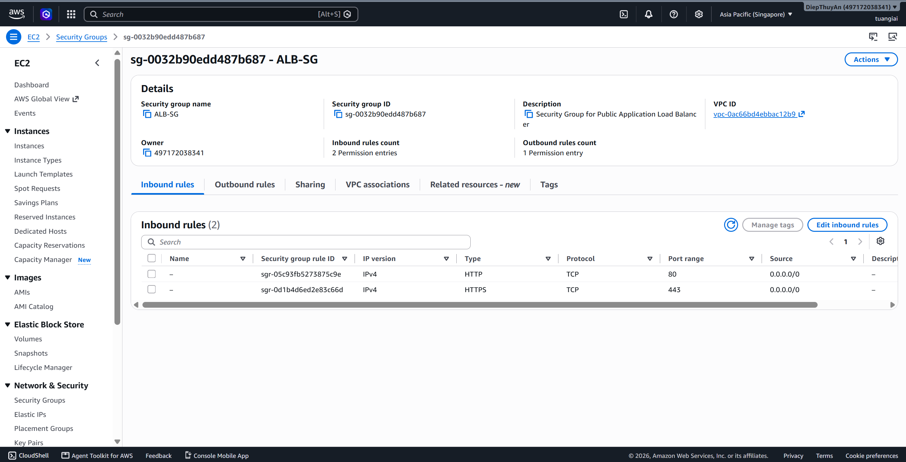

### 5.4.11. Tạo Application Load Balancer và cấu hình routing

#### 5.4.11.1. Tạo security group cho ALB

1. Mở EC2 Console → Security Groups.
2. Chọn Create security group.
3. Thiết lập:
   - Name: `alb-sg`
   - Description: `Security Group cho Public Application Load Balancer`
   - VPC: chọn VPC dự án
4. Thêm inbound rule:
   - HTTP `80` từ `0.0.0.0/0`
   - HTTPS `443` từ `0.0.0.0/0`
5. Giữ outbound rule mặc định.

#### 5.4.11.2. Tạo target group cho frontend và backend

- `TG-NeonFoodMap-FE` cho frontend
- `TG-NeonFoodMap-BE` cho backend

Các cấu hình chính:

- Target type: `IP addresses`
- Protocol/Port: frontend `HTTP:80`, backend `HTTP:8000`
- Health check protocol: `HTTP`
- Path check: `/` hoặc `/api/health`
- Healthy threshold: `2`
- Unhealthy threshold: `2`
- Interval: `30 seconds`

#### 5.4.11.3. Tạo Application Load Balancer

1. Mở EC2 Console → Load Balancers.
2. Chọn Create load balancer → Application Load Balancer.
3. Cấu hình:
   - Name: `ALB-NeonFoodMap`
   - Scheme: `Internet-facing`
   - IP address type: `IPv4`
4. Chọn public subnet phù hợp trong VPC.
5. Chọn security group `alb-sg`.
6. Cấu hình listener `HTTP:80` và route mặc định tới frontend target group.
7. Tạo load balancer.

#### 5.4.11.4. Tạo listener rule cho API path

1. Mở ALB → Listeners and rules.

2. Chọn listener `HTTP:80`.
3. Thêm rule:
   - Name: `route-backend-api`
   - Condition: `Path /api/*`
   - Action: Forward tới target group backend
4. Lưu rule.

