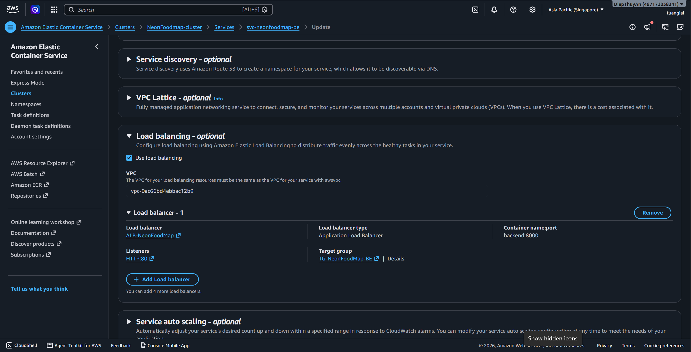

### 5.4.12. Liên kết ECS Service với ALB

Để ECS tự động đăng ký task vào target group, cần cấu hình load balancing trong ECS service.

1. Mở ECS Console.
2. Chọn cluster `neonfoodmap-cluster`.
3. Chọn service frontend hoặc backend.
4. Chỉnh sửa hoặc tạo mới service.
5. Trong phần Load balancing:
   - Chọn `Application Load Balancer`
   - Chọn `ALB-NeonFoodMap`
   - Chọn container tương ứng
   - Chọn listener `80:HTTP`
   - Chọn target group tương ứng
6. Lưu lại.

Kết quả:
- Backend

- Frontend

