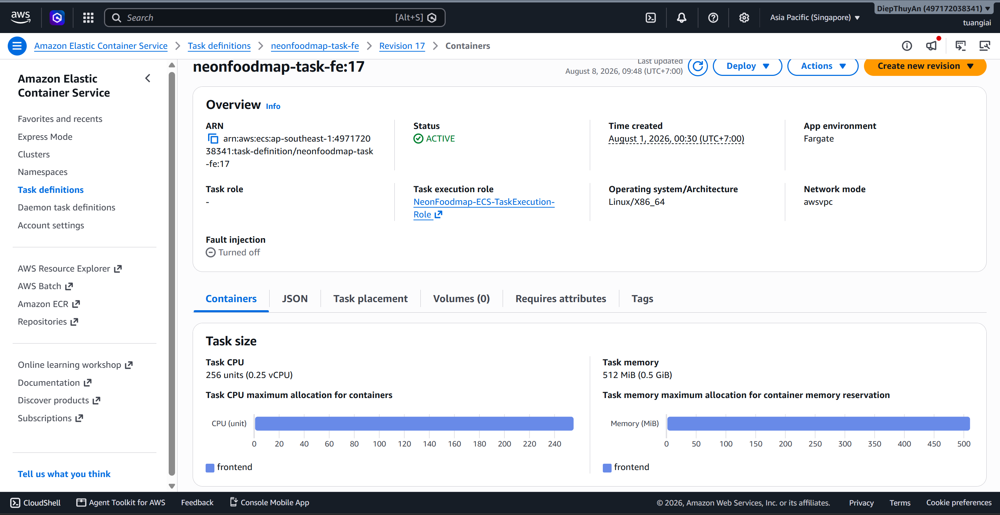
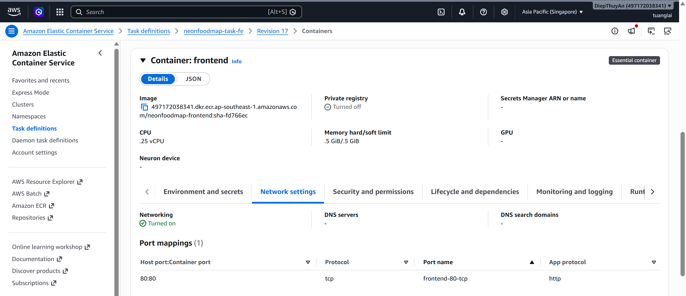
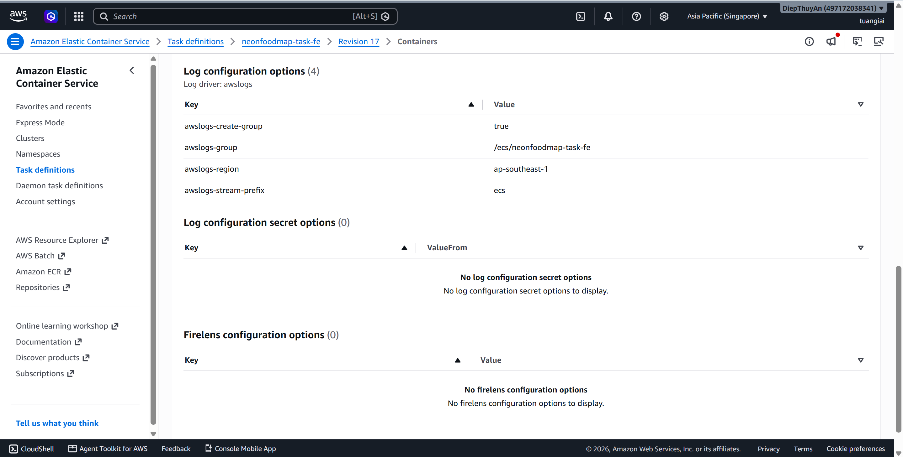
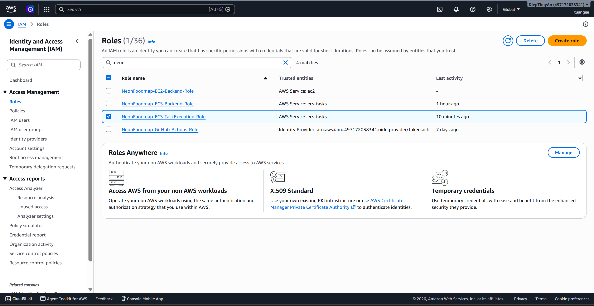
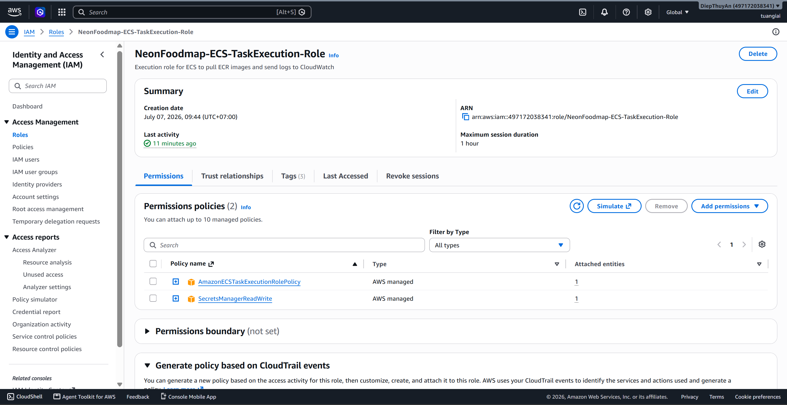
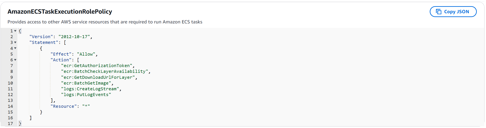
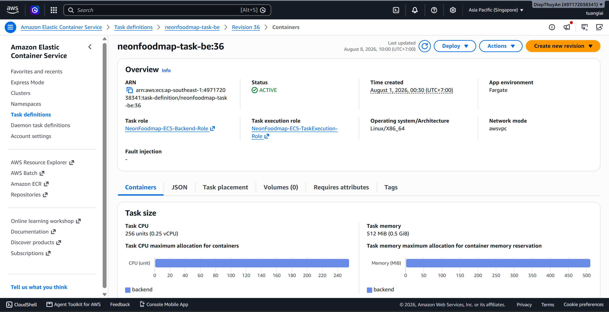
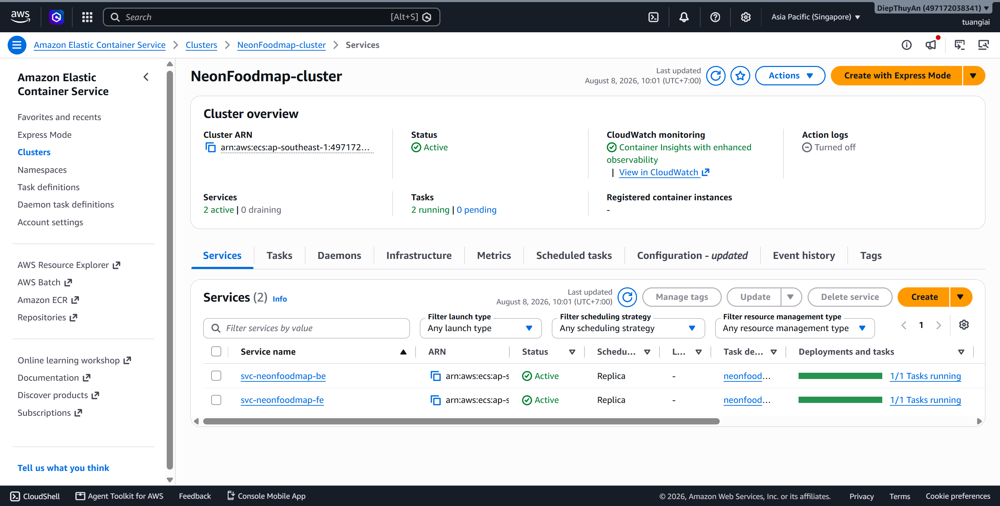

### 5.4.8. Tạo ECS Cluster và Service

Sau khi hoàn thành phần này, hệ thống sẽ đáp ứng các yêu cầu sau:

- Tạo thành công ECS Cluster sử dụng **AWS Fargate**.
- Cấu hình ECS Service sử dụng các Subnet thuộc **2 Availability Zones (AZ1, AZ2)** nhằm tăng tính sẵn sàng.
- Tạo Task Definition cho Backend và Frontend với CPU **256** và RAM **512 MB**.
- Cấu hình CloudWatch Logs cho các Container.
- Thiết lập biến môi trường và Secrets cho ứng dụng.
- Cấu hình IAM Task Execution Role cho phép ECS pull Docker Image từ Amazon ECR và ghi log lên CloudWatch.
- Kiểm tra Task khởi chạy và hoạt động bình thường.

---

### Các bước thực hiện

#### Bước 1. Tạo ECS Cluster sử dụng AWS Fargate

1. Truy cập **AWS Management Console**.

2. Tìm kiếm và chọn dịch vụ **Amazon ECS**.

3. Trong menu bên trái, chọn **Clusters**.

4. Chọn **Create cluster**.

5. Tại **Cluster name**, nhập tên Cluster:

```text
neonfoodmap-cluster
```

6. Tại phần **Infrastructure**, chọn:

```text
AWS Fargate (serverless)
```

7. Kiểm tra lại thông tin Cluster.

8. Chọn **Create** để tạo Cluster.

9. Sau khi tạo thành công, Cluster sẽ xuất hiện trong danh sách.

> **Lưu ý:** ECS Cluster là tài nguyên logic nên không được gán trực tiếp vào AZ1 hoặc AZ2. Việc chạy trên nhiều Availability Zone được cấu hình khi tạo ECS Service bằng cách lựa chọn các Subnet thuộc AZ1 và AZ2.

---


#### Bước 2. Tạo Task Definition cho Backend với CPU 256 và RAM 512 MB

Task Definition xác định cách ECS khởi chạy Backend Container, bao gồm Docker Image, CPU, RAM, Port, Environment Variables và Log Configuration.

1. Trong Amazon ECS, chọn **Task definitions**.

2. Chọn **Create new task definition**.

3. Nhập tên Task Definition:

```text
neonfoodmap-backend
```

4. Tại **Infrastructure requirements**, chọn:

```text
AWS Fargate
```

5. Cấu hình tài nguyên:

```text
CPU: 0.25 vCPU
Memory: 0.5 GB
```

Tương ứng:

```text
CPU: 256
RAM: 512 MiB
```

6. Tại **Task execution role**, chọn IAM Role dành cho ECS Task Execution.

Ví dụ:

```text
NeonFoodmap-ECS-TaskExecution-Role
```

7. Tại phần **Container**, chọn **Add container**.

8. Nhập tên Container:

```text
backend
```

9. Tại **Image URI**, nhập Docker Image Backend được lưu trên Amazon ECR.

Ví dụ:

```text
<AWS_ACCOUNT_ID>.dkr.ecr.<AWS_REGION>.amazonaws.com/<BACKEND_REPOSITORY>:latest
```

10. Cấu hình **Port mapping** theo Port mà Backend Container sử dụng.

Ví dụ:

```text
Container port: 8000
Protocol: TCP
```

11. Cấu hình **Environment variables** cần thiết cho ứng dụng.

Ví dụ:

```text
DJANGO_SETTINGS_MODULE
DEBUG
ALLOWED_HOSTS
AWS_REGION
```

12. Đối với các thông tin nhạy cảm như thông tin kết nối RDS hoặc API Key, cấu hình thông qua **Secrets** thay vì ghi trực tiếp giá trị vào Task Definition.

13. Cấu hình Container Logs sử dụng **Amazon CloudWatch Logs**.

Log Group sử dụng:

```text
/ecs/neonfoodmap-backend
```

14. Kiểm tra lại:

- Docker Image.
- CPU và RAM.
- Container Port.
- Environment Variables.
- Secrets.
- Task Execution Role.
- CloudWatch Log Group.

15. Chọn **Create** để tạo Task Definition.

---


#### Bước 3. Tạo Task Definition cho Frontend với CPU 256 và RAM 512 MB

Thực hiện tương tự Backend nhưng sử dụng Docker Image của Frontend.

1. Truy cập:

**Amazon ECS → Task definitions → Create new task definition**.

2. Nhập tên Task Definition:

```text
neonfoodmap-frontend
```

3. Chọn:

```text
AWS Fargate
```

4. Cấu hình tài nguyên:

```text
CPU: 0.25 vCPU
Memory: 0.5 GB
```

5. Chọn **Task execution role**:

```text
NeonFoodmap-ECS-TaskExecution-Role
```

6. Chọn **Add container**.

7. Nhập tên Container:

```text
frontend
```

8. Nhập Docker Image Frontend từ Amazon ECR.

Ví dụ:

```text
<AWS_ACCOUNT_ID>.dkr.ecr.<AWS_REGION>.amazonaws.com/<FRONTEND_REPOSITORY>:latest
```

9. Cấu hình Port Mapping theo Port mà Frontend Container sử dụng.

Ví dụ:

```text
Container port: 80
Protocol: TCP
```

10. Cấu hình các Environment Variables cần thiết cho Frontend.

11. Cấu hình CloudWatch Logs với Log Group:

```text
/ecs/neonfoodmap-frontend
```

12. Kiểm tra lại cấu hình và chọn **Create**.






---


#### Bước 4. Cấu hình CloudWatch Log Groups cho Backend và Frontend

CloudWatch Logs được sử dụng để tập trung log từ các Container ECS, phục vụ việc theo dõi hoạt động và xử lý sự cố.

1. Truy cập dịch vụ **Amazon CloudWatch**.

2. Chọn **Logs → Log groups**.

3. Chọn **Create log group**.

4. Tạo Log Group cho Backend:

```text
/ecs/neonfoodmap-backend
```

5. Chọn **Create**.

6. Tiếp tục tạo Log Group cho Frontend:

```text
/ecs/neonfoodmap-frontend
```

7. Kiểm tra cả hai Log Group đã xuất hiện.

8. Đối chiếu tên Log Group trong Task Definition với Log Group đã tạo.

| Container | CloudWatch Log Group |
|-----------|----------------------|
| Backend | `/ecs/neonfoodmap-backend` |
| Frontend | `/ecs/neonfoodmap-frontend` |

> Khi ECS Task khởi chạy, log của Container sẽ được gửi đến Log Group tương ứng thông qua cấu hình `awslogs`.

---

#### Bước 5. Thiết lập biến môi trường và Secrets cho RDS, API Key

Các thông tin cấu hình của ứng dụng được phân thành hai nhóm: **Environment Variables** và **Secrets**.

##### 5.1. Cấu hình Environment Variables

Trong Task Definition Backend, tại phần **Environment variables**, thêm các biến cấu hình không chứa thông tin nhạy cảm.

Ví dụ:

```text
DJANGO_SETTINGS_MODULE=config.settings
DEBUG=False
ALLOWED_HOSTS=<DOMAIN>
AWS_REGION=<AWS_REGION>
```

Các giá trị thực tế cần được thay thế theo môi trường triển khai.

##### 5.2. Cấu hình thông tin kết nối RDS

Các thông tin kết nối Database có thể bao gồm:

```text
DB_HOST
DB_NAME
DB_USER
DB_PASSWORD
DB_PORT
```

Trong đó các thông tin nhạy cảm như `DB_PASSWORD` nên được lưu trong **AWS Secrets Manager**.

Trong Task Definition:

1. Mở phần **Secrets** của Container Backend.

2. Chọn **Add secret**.

3. Nhập tên Environment Variable mà ứng dụng sử dụng.

4. Chọn Secret tương ứng trong **AWS Secrets Manager**.

Ví dụ:

```text
Name: DB_PASSWORD
ValueFrom: <RDS Database Secret>
```

##### 5.3. Cấu hình API Key

Đối với các API Key hoặc thông tin xác thực của dịch vụ bên ngoài, thực hiện tương tự:

```text
Name: API_KEY
ValueFrom: <API Key Secret>
```

5. Kiểm tra lại các biến môi trường và Secret đã khai báo.

6. Không ghi trực tiếp mật khẩu RDS hoặc API Key vào source code, Dockerfile hoặc file cấu hình được commit lên Git.

> Task cần được cấp quyền phù hợp để truy cập Secret từ AWS Secrets Manager.

---

#### Bước 6. Tạo Task Execution Role với quyền truy cập ECR

Task Execution Role cho phép ECS thực hiện các thao tác cần thiết trong quá trình khởi chạy Task.

1. Truy cập **AWS Console → IAM**.

2. Chọn **Roles**.

3. Tìm Role:

```text
NeonFoodmap-ECS-TaskExecution-Role
```



4. Mở Role và chọn tab **Permissions**.

5. Kiểm tra Role có các quyền cần thiết để:

- Pull Docker Image từ Amazon ECR.
- Ghi Container Logs vào Amazon CloudWatch Logs.
- Truy cập Secret từ AWS Secrets Manager nếu Task Definition sử dụng Secrets.



6. Đối với ECR, Role cần có quyền tương ứng để ECS/Fargate xác thực và pull Image từ Repository.



7. Quay lại **Amazon ECS → Task definitions**.

8. Mở Task Definition của Backend.

9. Kiểm tra **Task execution role** đang sử dụng:

```text
NeonFoodmap-ECS-TaskExecution-Role
```



10. Thực hiện kiểm tra tương tự với Task Definition của Frontend.

---

### Kiểm tra kết quả

Sau khi hoàn thành 6 bước trên, kiểm tra lại cấu hình trước khi tạo ECS Service:

| Thành phần | Kết quả mong đợi |
|------------|------------------|
| ECS Cluster | Đã tạo và ở trạng thái `ACTIVE` |
| Backend Task Definition | Đã tạo, CPU 256 và RAM 512 MiB |
| Frontend Task Definition | Đã tạo, CPU 256 và RAM 512 MiB |
| Backend Image | Trỏ đến Repository Backend trên ECR |
| Frontend Image | Trỏ đến Repository Frontend trên ECR |
| CloudWatch Logs | Có `/ecs/neonfoodmap-backend` và `/ecs/neonfoodmap-frontend` |
| Environment Variables | Đã cấu hình |
| Secrets | Đã cấu hình thông qua Secrets Manager |
| Task Execution Role | Đã gán cho Backend và Frontend |
| ECR Permission | Cho phép ECS pull Image |

Sau khi các cấu hình trên hoàn tất, hệ thống đã sẵn sàng để tạo **ECS Service** và triển khai các Task trên các Subnet thuộc **AZ1 và AZ2**.



