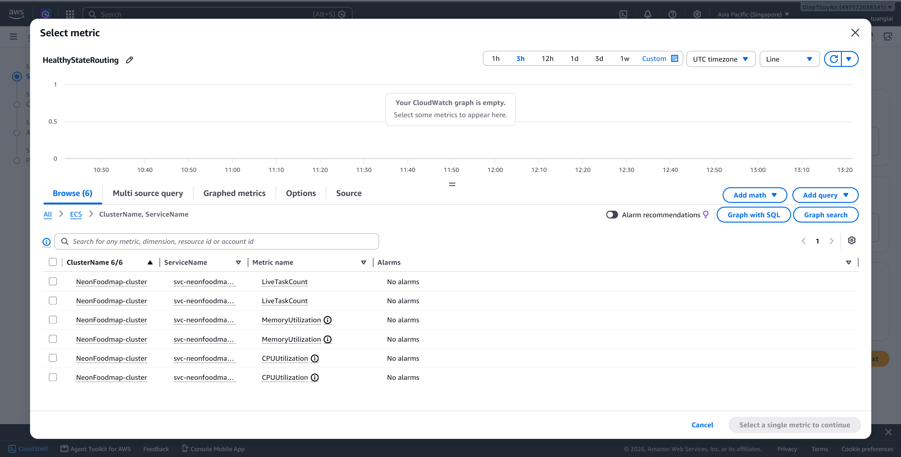
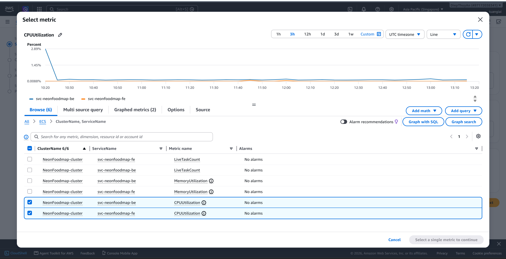
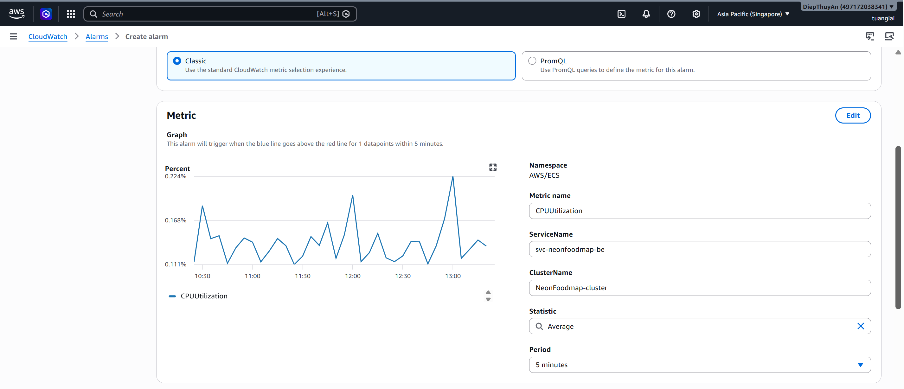
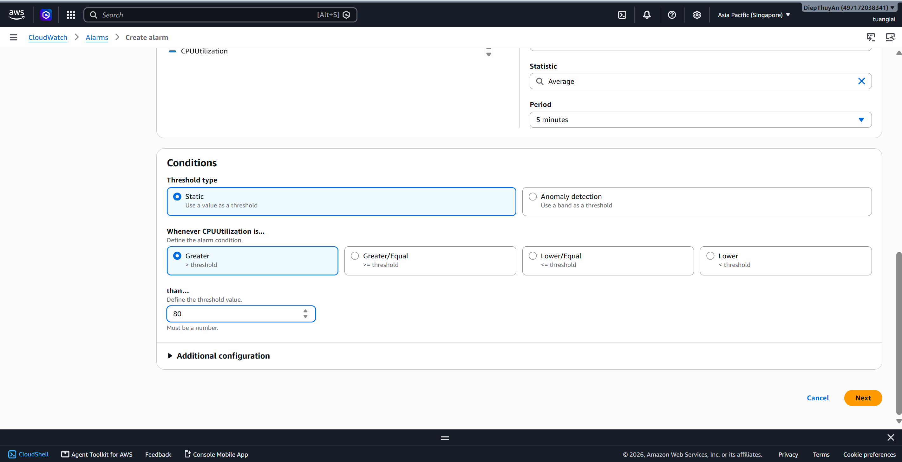

### 5.5.3. CloudWatch Dashboard

After completing this section, the system will meet the following requirements:

- Dashboard is displayed in CloudWatch
- All Metrics are updated in real time
- Alarms have been configured and tested
- Alarm notifications via Email are working properly
- CloudWatch Log Insights queries have been prepared

### Implementation Steps

#### Step 1. Create CloudWatch Dashboard

1. Log in to AWS Management Console.
2. Navigate to the CloudWatch service.
3. Select Dashboards.
4. Click Create dashboard.


5. Enter the Dashboard name (for example: NeonFoodMap-Operational-Dashboard).


6. Select to create a new Dashboard.
7. If a Dashboard in JSON format has already been prepared:

Select Actions → View/Edit source.
Paste the JSON template content.
Select Save.


---

#### Step 2. Add a Widget to Display ECS Metrics

1. Navigate to the Dashboard, select the newly created Dashboard NeonFoodMap-Operational-Dashboard, and select Add widget.


2. Select Data type: Metrics, Preferred experience: Metrics Console

3. Select Widget type: Line
   

4. Click Next, then navigate to ECS → ClusterName, ServiceName

5. Select the following Metric Name values:

CPU Utilization
Memory Utilization


6. Enter an appropriate Widget name and click Create widget.


---

#### Step 3. Add Application Load Balancer (ALB) Metrics Widget

1. Navigate to the Dashboard, select the newly created Dashboard NeonFoodMap-Operational-Dashboard, and select Add widget.


2. Select Data type: Metrics, Preferred experience: Metrics Console

3. Select Add widget.

4. Select CloudWatch Metrics, then click Next.


5. Select Per AppELB, per AZ, per TG Metrics, then add the following Metrics based on the Target Group configuration from the previous stage:

Healthy Host Count
UnHealthy Host Count
Target Response Time
Request Count
HTTPCode_Target_5XX_Count


6. Enter an appropriate Widget name and click Create widget.


---

#### Step 4. Add Amazon S3 Metrics Widget

1. Navigate to the Dashboard, select the newly created Dashboard NeonFoodMap-Operational-Dashboard, and select Add widget.


2. Select Data type: Metrics, Preferred experience: Metrics Console

3. Select Add widget.

4. Select CloudWatch Metrics, then click Next


5. In the Browse window, select the S3 namespace, then select the Bucket to monitor.


4. Select the Storage Metrics of the neonfoodmap-frontend-dev and neonfoodmap-logs Buckets:

BucketSizeBytes
NumberOfObjects


5. Enter an appropriate Widget name and click Create widget.


---

#### Step 5. Add CloudWatch Log Insights Widget

1. Navigate to the Dashboard, select the newly created Dashboard NeonFoodMap-Operational-Dashboard, and select Add widget.


2. Select Log query. Select the Log Groups of ECS, Application, and ALB


4. Enter the following command into CloudWatch Log Insights to query log records containing errors (ERROR, Exception, or status code 500) from the last 7 days.

```sql
SOURCE "arn:aws:logs:ap-southeast-1:497172038341:log-group:/ecs/neonfoodmap-backend" START=-604800s END=0s
| SOURCE "arn:aws:logs:ap-southeast-1:497172038341:log-group:/ecs/neonfoodmap-task-be"
| fields @timestamp, @message
| filter @message like /ERROR|Exception|500/
| sort @timestamp desc
| limit 20
```


5. Check the returned results, save the Widget to the Dashboard by clicking create, then click Save on the DashboardsNeonFoodMap-Operational-Dashboard screen to save the entire list of Widgets.


---

#### Step 6. Add Amazon RDS Metrics Widget

Repeat the same process as the steps above, as follows:

1. Select Add widget.
2. Select Metrics for Amazon RDS.
3. Select the Database Instance.
4. Add the following Metrics:

CPU Utilization
Database Connections
Read Latency
Write Latency
Free Storage Space 5. Save the Widget.

---

#### Step 7. Create CloudWatch Alarms

CloudWatch Alarms help monitor the system's Metrics and automatically detect when resources exceed the allowed threshold. In this section, an alarm will be created to monitor the CPU utilization of the ECS Service.

1. Navigate to CloudWatch → Alarms.

2. Select Create alarm to create a new alarm.


3. At the Specify metric and conditions step, click Select metric to select the Metric to monitor.


4. In the Metric list, select:

ECS
ClusterName, ServiceName



5. Select the CPUUtilization Metric of the ECS Service, then click Select metric.



6. Configure the Alarm trigger conditions:

Statistic: Average
Period: 5 minutes
Threshold type: Static
Whenever CPUUtilization is: Greater than
Threshold value: 80

CloudWatch will change the Alarm to the ALARM state when the average CPU utilization exceeds 80% during the evaluation period.




7. At the Configure actions step, select the action to take when the Alarm is triggered. You can choose to send notifications through an SNS Topic or skip this step if you only need to monitor the status.


8. Enter a name for the Alarm, for example:

Alarm name: ECS-Backend-High-CPU-Alarm

You can add a description to make it easier to manage later.


9. Review the entire configuration and click Create alarm to complete the process.


10. After successfully creating the Alarm, it will appear in the CloudWatch Alarms list with an initial status of OK. When the CPU value exceeds the configured threshold, the status will automatically change to ALARM.


> Note: Similarly, additional CloudWatch Alarms can be created to monitor the system, such as:
>
> - HTTPCode_Target_5XX_Count > 10 errors/minute.
> - MemoryUtilization > 80%.
> - TargetResponseTime exceeds the desired threshold.
> - HealthyHostCount falls below the minimum number.

#### Step 8. Create an SNS Topic to Send Notifications and Subscribe an Email Address

1. Navigate to the Amazon SNS service, select Topics, and click Create topic.

2. Select the Standard type.

3. Enter the Topic name (for example: NeonFoodMap-Alerts-Topic).

4. Complete the Topic creation process.


5. Open the newly created Topic and select Create subscription.


6. Protocol: select Email

7. Enter the Email address of the operations team or a personal Email address.

8. Submit the Subscription, open the Email, and click Confirm Subscription to activate it.


