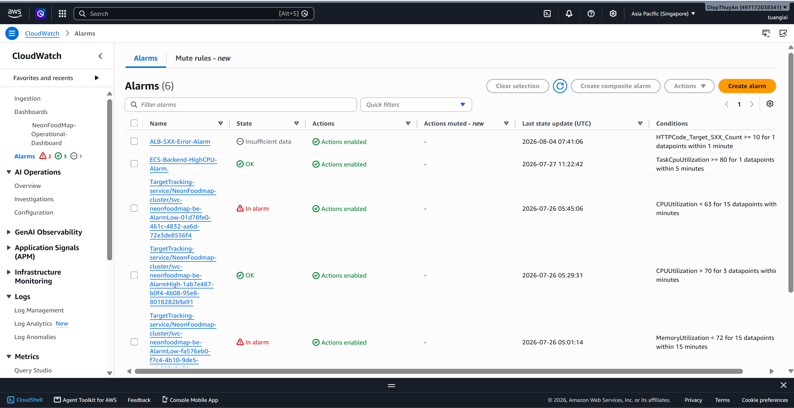
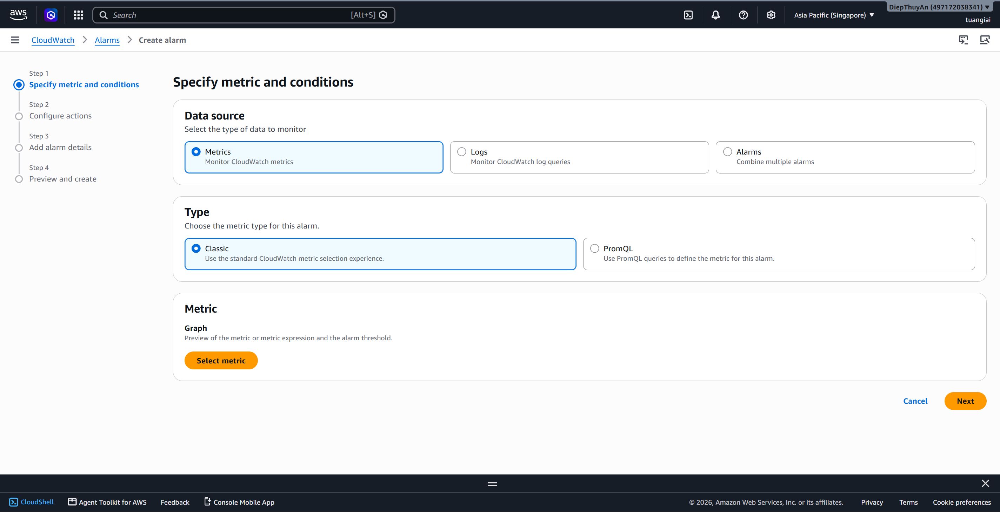
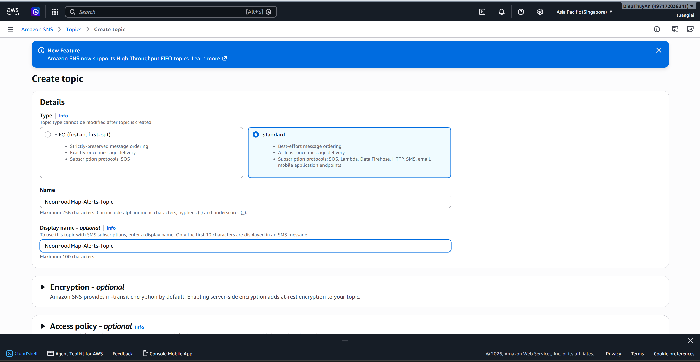
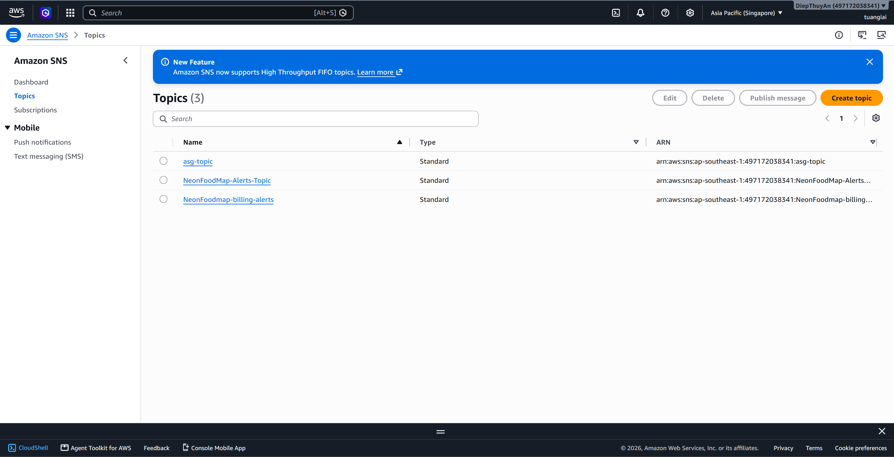

### 5.5.3. CloudWatch Dashboard 

Sau khi hoàn thành phần này, hệ thống sẽ đáp ứng các yêu cầu sau:

- Dashboard hiển thị trong CloudWatch
- Tất cả các chỉ số (Metrics) được cập nhật theo thời gian thực
- Các cảnh báo (Alarms) đã được cấu hình và kiểm thử
- Thông báo alarm qua Email hoạt động bình thường
- Các truy vấn CloudWatch Log Insights đã được chuẩn bị

### Các bước thực hiện
#### Bước 1. Tạo CloudWatch Dashboard

1. Đăng nhập **AWS Management Console**.
2. Truy cập dịch vụ **CloudWatch**.
3. Chọn **Dashboards**.
4. Nhấn **Create dashboard**.


5. Nhập tên Dashboard (ví dụ: `NeonFoodMap-Operational-Dashboard`).


6. Chọn tạo Dashboard mới.
7. Nếu đã chuẩn bị sẵn Dashboard dạng JSON:
   - Chọn **Actions** → **View/Edit source**.
   - Dán nội dung JSON template.
   - Chọn **Save**.


---

#### Bước 2. Thêm Widget hiển thị Metrics của ECS

1. Truy cập Dashboard, chọn Dashboard `NeonFoodMap-Operational-Dashboard` vừa mới tạo, chọn **Add widget**.


2. Chọn Data type: **Metrics**, Preferred experience: **Metrics Console**

3. Chọn Widget type: **Line**


4. Nhấn **Next**, điều hướng đến **ECS → ClusterName, ServiceName**

5. Nhấn chọn các **Metric Name** như sau:
   - CPU Utilization
   - Memory Utilization


6. Đặt tên Widget phù hợp, nhấn **Create widget**.


---

#### Bước 3. Thêm Widget Metrics của Application Load Balancer (ALB)
1. Truy cập Dashboard, chọn Dashboard `NeonFoodMap-Operational-Dashboard` vừa mới tạo, chọn **Add widget**.


2. Chọn Data type: **Metrics**, Preferred experience: **Metrics Console**


3. Chọn **Add widget**.

4. Chọn **CloudWatch Metrics**, nhấn **Next**.


5. Chọn **Per AppELB, per AZ, per TG Metrics**, thêm các Metrics sau dựa vào cấu hình Targer Group ở giai đoạn trước:
   - Healthy Host Count
   - UnHealthy Host Count
   - Target Response Time
   - Request Count
   - HTTPCode_Target_5XX_Count


6. Đặt tên Widget phù hợp, nhấn **Create widget**.


---

#### Bước 4. Thêm Widget Metrics của Amazon S3

1. Truy cập Dashboard, chọn Dashboard `NeonFoodMap-Operational-Dashboard` vừa mới tạo, chọn **Add widget**.


2. Chọn Data type: **Metrics**, Preferred experience: **Metrics Console**

3. Chọn **Add widget**.

4. Chọn **CloudWatch Metrics**, nhấn **Next**


5. Trong cửa sổ **Browse**, chọn namespace **S3**, sau đó chọn Bucket cần theo dõi.


4. Chọn các Storage Metrics của Bucket `neonfoodmap-frontend-dev` và `neonfoodmap-logs`:
   - **BucketSizeBytes**
   - **NumberOfObjects**


5. Đặt tên Widget phù hợp, nhấn **Create widget**.


---

####   Bước 5. Thêm Widget CloudWatch Log Insights
1. Truy cập Dashboard, chọn Dashboard `NeonFoodMap-Operational-Dashboard` vừa mới tạo, chọn **Add widget**.


2. Chọn **Log query**. Chọn Log Group của **ECS**, **Application**, **ALB**


4. Nhập câu lệnh sau vào **CloudWatch Log Insights** để truy vấn các bản ghi log chứa lỗi (`ERROR`, `Exception` hoặc mã trạng thái `500`) trong 7 ngày gần nhất.

```sql
SOURCE "arn:aws:logs:ap-southeast-1:497172038341:log-group:/ecs/neonfoodmap-backend" START=-604800s END=0s
| SOURCE "arn:aws:logs:ap-southeast-1:497172038341:log-group:/ecs/neonfoodmap-task-be"
| fields @timestamp, @message
| filter @message like /ERROR|Exception|500/
| sort @timestamp desc
| limit 20
```


5. Kiểm tra kết quả trả về, lưu Widget vào Dashboard bằng cách nhấn **create**, sau đó nhấn **Save** tại màn hình `DashboardsNeonFoodMap-Operational-Dashboard` để lưu toàn bộ danh sách Widget.


---

#### Bước 6. Thêm Widget Metrics của Amazon RDS

Lặp lại tương tự như các bước ở trên, cách làm như sau:

1. Chọn **Add widget**.
2. Chọn Metrics của **Amazon RDS**.
3. Chọn Database Instance.
4. Thêm các Metrics:
   - CPU Utilization
   - Database Connections
   - Read Latency
   - Write Latency
   - Free Storage Space
5. Lưu Widget.

---

#### Bước 7. Tạo CloudWatch Alarms

CloudWatch Alarms giúp giám sát các chỉ số (Metrics) của hệ thống và tự động phát hiện khi tài nguyên hoạt động vượt quá ngưỡng cho phép. Trong phần này, sẽ tạo cảnh báo theo dõi mức sử dụng CPU của ECS Service.

1. Truy cập **CloudWatch** → **Alarms**.

2. Chọn **Create alarm** để tạo cảnh báo mới.



3. Tại bước **Specify metric and conditions**, nhấn **Select metric** để lựa chọn Metric cần theo dõi.




4. Trong danh sách Metric, chọn:

   - **ECS**
   - **ClusterName, ServiceName**


5. Chọn Metric **CPUUtilization** của ECS Service, sau đó nhấn **Select metric**.


6. Cấu hình điều kiện kích hoạt Alarm:

   - **Statistic:** Average
   - **Period:** 5 minutes
   - **Threshold type:** Static
   - **Whenever CPUUtilization is:** Greater than
   - **Threshold value:** 80

CloudWatch sẽ chuyển Alarm sang trạng thái **ALARM** khi mức sử dụng CPU trung bình vượt quá **80%** trong khoảng thời gian đánh giá.


7. Tại bước **Configure actions**, lựa chọn hành động khi Alarm được kích hoạt. Có thể chọn gửi thông báo thông qua **SNS Topic** hoặc bỏ qua nếu chỉ cần theo dõi trạng thái.


8. Đặt tên cho Alarm, ví dụ:

   - **Alarm name:** `ECS-Backend-High-CPU-Alarm`

Có thể bổ sung mô tả để dễ dàng quản lý về sau.


9. Kiểm tra lại toàn bộ cấu hình và nhấn **Create alarm** để hoàn tất.


10. Sau khi tạo thành công, Alarm sẽ xuất hiện trong danh sách **CloudWatch Alarms** với trạng thái ban đầu là **OK**. Khi giá trị CPU vượt ngưỡng đã thiết lập, trạng thái sẽ tự động chuyển sang **ALARM**.


> **Lưu ý:** Tương tự, có thể tạo thêm các CloudWatch Alarm khác để giám sát hệ thống như:
>
> - **HTTPCode_Target_5XX_Count** > 10 lỗi/phút.
> - **MemoryUtilization** > 80%.
> - **TargetResponseTime** vượt ngưỡng mong muốn.
> - **HealthyHostCount** giảm xuống dưới số lượng tối thiểu.

#### Bước 8. Tạo SNS Topic để gửi thông báo và đăng ký Email nhận thông báo

1. Truy cập dịch vụ **Amazon SNS**, chọn **Topics**, nhấn **Create topic**.

2. Chọn loại **Standard**.

3. Đặt tên Topic (ví dụ: `NeonFoodMap-Alerts-Topic`).

4. Hoàn tất việc tạo Topic.






5. Mở Topic vừa tạo, chọn **Create subscription**.


6. Protocol: chọn **Email**

7. Nhập địa chỉ Email của nhóm vận hành hoặc địa chỉ Email cá nhân.

8. Gửi Subscription, mở Email và nhấn **Confirm Subscription** để kích hoạt.


---