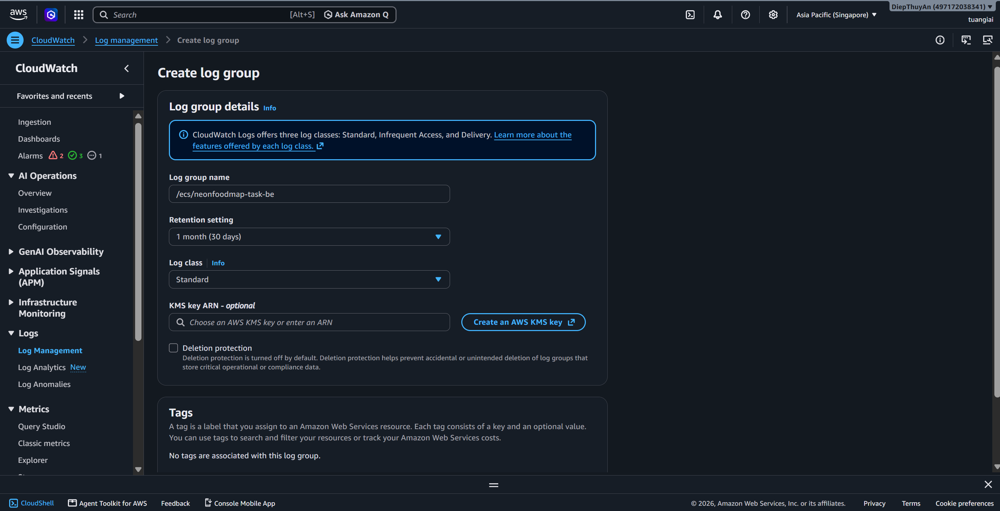
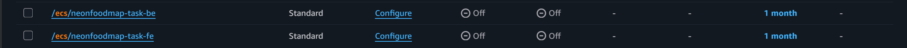
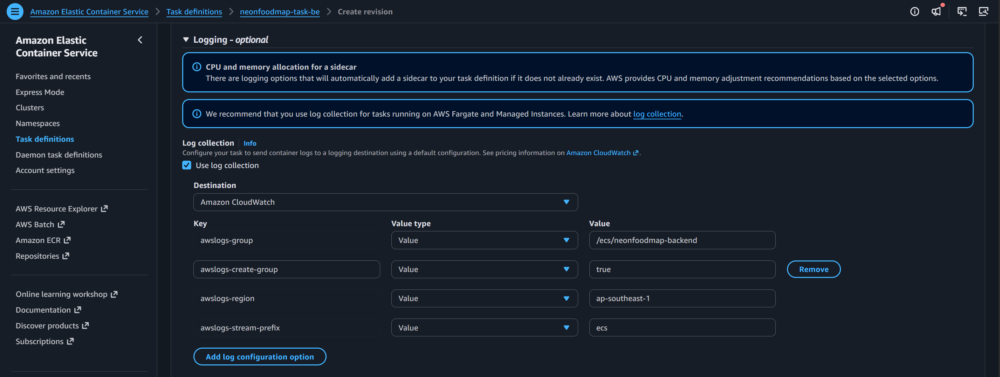

---

title : "CloudWatch Logs and Log Insights"
date : 2024-01-01
weight : 5
chapter : false
pre : " <b> 5.5.5. </b> "
-------------------------

### 5.5.5. CloudWatch Logs and Log Insights

After completing this section, the system will meet the following requirements:

* Set the Log retention period to **30 days**
* Create a Log Group for **Application Logs**
* Create Log Groups for storing and managing system logs
* Perform Log queries using **CloudWatch Logs Insights**
* Enable **VPC Flow Logs** to monitor network traffic within the VPC
* Verify the system's ability to collect and analyze Logs

---

## Implementation Steps

### Step 1. Configure the Log Retention Period (Retention Policy)

By default, CloudWatch stores Logs indefinitely. To optimize storage costs, configure the Log retention period to **30 days**.

1. Sign in to the **AWS Management Console**.
2. Navigate to the **CloudWatch** service.
3. Select **Log groups**.


4. Select the Log Group to configure.
5. Select **Actions → Edit retention setting**.


6. Under **Retention setting**, select **30 Days**.
7. Click **Save** to save the configuration.


> **Note:** Repeat the same procedure for all Log Groups in the system to ensure that the retention policy is applied consistently.

---

### Step 2. Create a Log Group

A Log Group is used to store and manage Logs generated by AWS services such as ECS, Lambda, or VPC Flow Logs.

1. In **CloudWatch**, select **Log groups**.

2. Click **Create log group**.

3. Enter a Log Group name, for example:

```
/ecs/neonfoodmap-task-be
```

or

```
/ecs/neonfoodmap-task-fe
```

4. Keep the default settings.



5. Click **Create** to complete the process.

6. After the Log Group is successfully created, it will appear in the list.



---

### Step 3. Configure ECS to Send Logs to CloudWatch

To allow ECS containers to send Logs directly to CloudWatch, configure the **awslogs Log Driver** in the Task Definition.

1. Navigate to **Amazon ECS**.
2. Select **Task Definitions** and open the application's Task Definition.
3. Select **Create new revision**.
4. Under **Container Definitions**, configure the following settings:

* **Log driver:** `awslogs`
* **Log group:** `/ecs/neonfoodmap-backend`
* **AWS Region:** `ap-southeast-1`
* **Stream prefix:** `ecs`



5. Save the new Task Definition.
6. Update the ECS Service to use the newly created Revision.
7. After the Deployment is completed, Logs will automatically be sent to CloudWatch.


---

### Step 4. Query Logs Using CloudWatch Logs Insights

CloudWatch Logs Insights allows Logs to be searched, aggregated, and analyzed in real time.

1. Navigate to **CloudWatch → Logs Insights**.
2. Select the Log Group to analyze.
3. Enter a Logs Insights query or use a previously saved query.
4. Click **Run query** to execute the query.

It can be used to:

* Find Log records containing Exceptions.
* Count the number of Errors over time.
* Find HTTP Status Code 500.
* Analyze Requests with long processing times.
* Find the IP addresses with the highest number of Requests.

5. If the query needs to be reused, select **Save query**.
6. Enter a query name and save it.


---

### Step 5. Configure VPC Flow Logs

VPC Flow Logs record network traffic entering and leaving the VPC, helping with connectivity troubleshooting and traffic analysis.

1. Navigate to the **Amazon VPC** service.
2. Select **Your VPCs**.
3. Select the VPC used by the system.


4. Select the **Flow logs** tab.
5. Click **Create flow log**.
6. Configure the following settings:

* **Filter:** All
* **Destination:** Send to CloudWatch Logs
* **Destination log group:** Select the previously created Log Group
* **IAM Role:** Select a Role with permission to write Logs to CloudWatch

7. Click **Create flow log** to complete the configuration.


---

### Step 6. Verify Logs and Perform Queries

After completing the configuration, verify the system's ability to collect and analyze Logs.

1. Navigate to **CloudWatch → Logs Insights**.
2. Select the application's Log Group.
3. Execute the previously created queries.
4. Check the results:

* Logs are recorded completely.
* Logs can be filtered by time range.
* Queries return the expected data.
* Logs can be searched by keywords or Log level.

5. Confirm that new Logs continue to be updated while the application is running.
6. Complete the CloudWatch Logs and Log Insights configuration.
